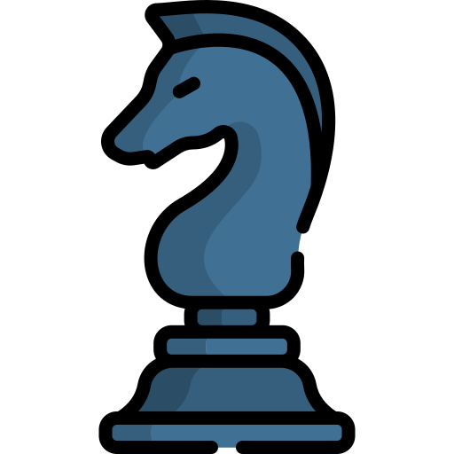
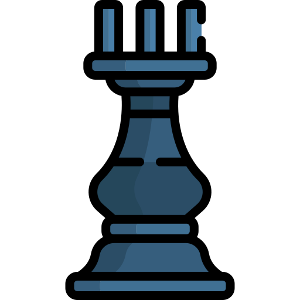

# ♟️milaabl's GitHub README Chess Tournament

This is an open chess tournament where ANYONE can play. That's the fun part.  
It's your turn to play! Move a <!-- BEGIN TURN -->white<!-- END TURN --> piece.

<!-- BEGIN CHESS BOARD -->
|   | A | B | C | D | E | F | G | H |   |
|---|:-:|:-:|:-:|:-:|:-:|:-:|:-:|:-:|:-:|
| **8** |  |  |  |  |  |  |  |  | **8** |
| **7** |  |  |  |  |  |  |  |  | **7** |
| **6** |  |  |  |  |  |  |  |  | **6** |
| **5** |  |  |  |  |  |  |  |  | **5** |
| **4** |  |  |  |  |  |  |  |  | **4** |
| **3** |  |  |  |  |  |  |  |  | **3** |
| **2** |  |  |  |  |  |  |  |  | **2** |
| **1** |  |  |  |  |  |  |  |  | **1** |
|   | **A** | **B** | **C** | **D** | **E** | **F** | **G** | **H** |   |
<!-- END CHESS BOARD -->

**It's your turn to move! Choose one from the following table**
<!-- BEGIN MOVES LIST -->
|  FROM  | TO (Just click a link!) |
| :----: | :---------------------- |
| **A2** | [A1](https://github.com/milaabl/readme-chess/issues/new?body=Please+do+not+change+the+title.+Just+click+%22Submit+new+issue%22.+You+don%27t+need+to+do+anything+else+%3AD&title=Chess%3A+Move+A2+to+A1), [A3](https://github.com/milaabl/readme-chess/issues/new?body=Please+do+not+change+the+title.+Just+click+%22Submit+new+issue%22.+You+don%27t+need+to+do+anything+else+%3AD&title=Chess%3A+Move+A2+to+A3) |
| **B1** | [A3](https://github.com/milaabl/readme-chess/issues/new?body=Please+do+not+change+the+title.+Just+click+%22Submit+new+issue%22.+You+don%27t+need+to+do+anything+else+%3AD&title=Chess%3A+Move+B1+to+A3), [C3](https://github.com/milaabl/readme-chess/issues/new?body=Please+do+not+change+the+title.+Just+click+%22Submit+new+issue%22.+You+don%27t+need+to+do+anything+else+%3AD&title=Chess%3A+Move+B1+to+C3), [D2](https://github.com/milaabl/readme-chess/issues/new?body=Please+do+not+change+the+title.+Just+click+%22Submit+new+issue%22.+You+don%27t+need+to+do+anything+else+%3AD&title=Chess%3A+Move+B1+to+D2) |
| **B2** | [B3](https://github.com/milaabl/readme-chess/issues/new?body=Please+do+not+change+the+title.+Just+click+%22Submit+new+issue%22.+You+don%27t+need+to+do+anything+else+%3AD&title=Chess%3A+Move+B2+to+B3), [B4](https://github.com/milaabl/readme-chess/issues/new?body=Please+do+not+change+the+title.+Just+click+%22Submit+new+issue%22.+You+don%27t+need+to+do+anything+else+%3AD&title=Chess%3A+Move+B2+to+B4) |
| **C2** | [C3](https://github.com/milaabl/readme-chess/issues/new?body=Please+do+not+change+the+title.+Just+click+%22Submit+new+issue%22.+You+don%27t+need+to+do+anything+else+%3AD&title=Chess%3A+Move+C2+to+C3), [C4](https://github.com/milaabl/readme-chess/issues/new?body=Please+do+not+change+the+title.+Just+click+%22Submit+new+issue%22.+You+don%27t+need+to+do+anything+else+%3AD&title=Chess%3A+Move+C2+to+C4) |
| **E1** | [D1](https://github.com/milaabl/readme-chess/issues/new?body=Please+do+not+change+the+title.+Just+click+%22Submit+new+issue%22.+You+don%27t+need+to+do+anything+else+%3AD&title=Chess%3A+Move+E1+to+D1), [D2](https://github.com/milaabl/readme-chess/issues/new?body=Please+do+not+change+the+title.+Just+click+%22Submit+new+issue%22.+You+don%27t+need+to+do+anything+else+%3AD&title=Chess%3A+Move+E1+to+D2) |
| **E2** | [A6](https://github.com/milaabl/readme-chess/issues/new?body=Please+do+not+change+the+title.+Just+click+%22Submit+new+issue%22.+You+don%27t+need+to+do+anything+else+%3AD&title=Chess%3A+Move+E2+to+A6), [B5](https://github.com/milaabl/readme-chess/issues/new?body=Please+do+not+change+the+title.+Just+click+%22Submit+new+issue%22.+You+don%27t+need+to+do+anything+else+%3AD&title=Chess%3A+Move+E2+to+B5), [C4](https://github.com/milaabl/readme-chess/issues/new?body=Please+do+not+change+the+title.+Just+click+%22Submit+new+issue%22.+You+don%27t+need+to+do+anything+else+%3AD&title=Chess%3A+Move+E2+to+C4), [D1](https://github.com/milaabl/readme-chess/issues/new?body=Please+do+not+change+the+title.+Just+click+%22Submit+new+issue%22.+You+don%27t+need+to+do+anything+else+%3AD&title=Chess%3A+Move+E2+to+D1), [D2](https://github.com/milaabl/readme-chess/issues/new?body=Please+do+not+change+the+title.+Just+click+%22Submit+new+issue%22.+You+don%27t+need+to+do+anything+else+%3AD&title=Chess%3A+Move+E2+to+D2), [D3](https://github.com/milaabl/readme-chess/issues/new?body=Please+do+not+change+the+title.+Just+click+%22Submit+new+issue%22.+You+don%27t+need+to+do+anything+else+%3AD&title=Chess%3A+Move+E2+to+D3), [E3](https://github.com/milaabl/readme-chess/issues/new?body=Please+do+not+change+the+title.+Just+click+%22Submit+new+issue%22.+You+don%27t+need+to+do+anything+else+%3AD&title=Chess%3A+Move+E2+to+E3), [E4](https://github.com/milaabl/readme-chess/issues/new?body=Please+do+not+change+the+title.+Just+click+%22Submit+new+issue%22.+You+don%27t+need+to+do+anything+else+%3AD&title=Chess%3A+Move+E2+to+E4), [E5](https://github.com/milaabl/readme-chess/issues/new?body=Please+do+not+change+the+title.+Just+click+%22Submit+new+issue%22.+You+don%27t+need+to+do+anything+else+%3AD&title=Chess%3A+Move+E2+to+E5), [F1](https://github.com/milaabl/readme-chess/issues/new?body=Please+do+not+change+the+title.+Just+click+%22Submit+new+issue%22.+You+don%27t+need+to+do+anything+else+%3AD&title=Chess%3A+Move+E2+to+F1) |
| **F2** | [G3](https://github.com/milaabl/readme-chess/issues/new?body=Please+do+not+change+the+title.+Just+click+%22Submit+new+issue%22.+You+don%27t+need+to+do+anything+else+%3AD&title=Chess%3A+Move+F2+to+G3) |
| **F3** | [D2](https://github.com/milaabl/readme-chess/issues/new?body=Please+do+not+change+the+title.+Just+click+%22Submit+new+issue%22.+You+don%27t+need+to+do+anything+else+%3AD&title=Chess%3A+Move+F3+to+D2), [D4](https://github.com/milaabl/readme-chess/issues/new?body=Please+do+not+change+the+title.+Just+click+%22Submit+new+issue%22.+You+don%27t+need+to+do+anything+else+%3AD&title=Chess%3A+Move+F3+to+D4), [E5](https://github.com/milaabl/readme-chess/issues/new?body=Please+do+not+change+the+title.+Just+click+%22Submit+new+issue%22.+You+don%27t+need+to+do+anything+else+%3AD&title=Chess%3A+Move+F3+to+E5), [G1](https://github.com/milaabl/readme-chess/issues/new?body=Please+do+not+change+the+title.+Just+click+%22Submit+new+issue%22.+You+don%27t+need+to+do+anything+else+%3AD&title=Chess%3A+Move+F3+to+G1), [H2](https://github.com/milaabl/readme-chess/issues/new?body=Please+do+not+change+the+title.+Just+click+%22Submit+new+issue%22.+You+don%27t+need+to+do+anything+else+%3AD&title=Chess%3A+Move+F3+to+H2), [H4](https://github.com/milaabl/readme-chess/issues/new?body=Please+do+not+change+the+title.+Just+click+%22Submit+new+issue%22.+You+don%27t+need+to+do+anything+else+%3AD&title=Chess%3A+Move+F3+to+H4) |
| **H1** | [F1](https://github.com/milaabl/readme-chess/issues/new?body=Please+do+not+change+the+title.+Just+click+%22Submit+new+issue%22.+You+don%27t+need+to+do+anything+else+%3AD&title=Chess%3A+Move+H1+to+F1), [G1](https://github.com/milaabl/readme-chess/issues/new?body=Please+do+not+change+the+title.+Just+click+%22Submit+new+issue%22.+You+don%27t+need+to+do+anything+else+%3AD&title=Chess%3A+Move+H1+to+G1), [H2](https://github.com/milaabl/readme-chess/issues/new?body=Please+do+not+change+the+title.+Just+click+%22Submit+new+issue%22.+You+don%27t+need+to+do+anything+else+%3AD&title=Chess%3A+Move+H1+to+H2), [H3](https://github.com/milaabl/readme-chess/issues/new?body=Please+do+not+change+the+title.+Just+click+%22Submit+new+issue%22.+You+don%27t+need+to+do+anything+else+%3AD&title=Chess%3A+Move+H1+to+H3) |
<!-- END MOVES LIST -->

Having fun? Ask a friend to do the next move!

#### How it works

When you click on a link and submit a new issue with the desired move, a GitHub action is triggered, which in turn runs a small python script that performs the specified movement, updates this README file and commits the changes.

  
Last 5 moves in this game

<!-- BEGIN LAST MOVES -->

| Move | Author |
| :--: | :----- |
| `E4` to `G3` | [ @occupyashanti](https://github.com/occupyashanti) |
| `D1` to `E2` | [ @daemon-node-byte](https://github.com/daemon-node-byte) |
| `G4` to `H3` | [ @StackOverflowIsBetterThanAnyAI](https://github.com/StackOverflowIsBetterThanAnyAI) |
| `F1` to `H3` | [ @przemek890](https://github.com/przemek890) |
| `C8` to `G4` | [ @b8zhong](https://github.com/b8zhong) |

<!-- END LAST MOVES -->

  
Top 10 most moves across all games

<!-- BEGIN TOP MOVES -->

| Total moves |  User  |
| :---------: | :----- |
| 22 | [@milaabl](https://github.com/milaabl) |
| 14 | [@przemek890](https://github.com/przemek890) |
| 8 | [@AzeemIdrisi](https://github.com/AzeemIdrisi) |
| 4 | [@b-hristov](https://github.com/b-hristov) |
| 3 | [@IGR2014](https://github.com/IGR2014) |
| 3 | [@zadif](https://github.com/zadif) |
| 2 | [@CloverGit](https://github.com/CloverGit) |
| 2 | [@daemon-node-byte](https://github.com/daemon-node-byte) |
| 2 | [@abdbbdii](https://github.com/abdbbdii) |
| 2 | [@PanagiotisKots](https://github.com/PanagiotisKots) |

<!-- END TOP MOVES -->

---
