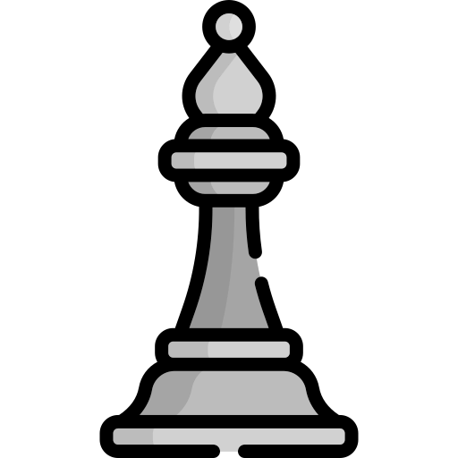

# ♟️milaabl's GitHub README Chess Tournament

This is an open chess tournament where ANYONE can play. That's the fun part.  
It's your turn to play! Move a <!-- BEGIN TURN -->black<!-- END TURN --> piece.

<!-- BEGIN CHESS BOARD -->
|   | A | B | C | D | E | F | G | H |   |
|---|:-:|:-:|:-:|:-:|:-:|:-:|:-:|:-:|:-:|
| **8** |  |  |  |  |  |  |  |  | **8** |
| **7** |  |  |  |  |  |  |  |  | **7** |
| **6** |  |  |  |  |  |  |  |  | **6** |
| **5** |  |  |  |  |  |  |  |  | **5** |
| **4** |  |  |  |  |  |  |  |  | **4** |
| **3** |  |  |  |  |  |  |  |  | **3** |
| **2** |  |  |  |  |  |  |  |  | **2** |
| **1** |  |  |  |  |  |  |  |  | **1** |
|   | **A** | **B** | **C** | **D** | **E** | **F** | **G** | **H** |   |
<!-- END CHESS BOARD -->

**It's your turn to move! Choose one from the following table**
<!-- BEGIN MOVES LIST -->
|  FROM  | TO (Just click a link!) |
| :----: | :---------------------- |
| **A7** | [A5](https://github.com/milaabl/readme-chess/issues/new?body=Please+do+not+change+the+title.+Just+click+%22Submit+new+issue%22.+You+don%27t+need+to+do+anything+else+%3AD&title=Chess%3A+Move+A7+to+A5), [A6](https://github.com/milaabl/readme-chess/issues/new?body=Please+do+not+change+the+title.+Just+click+%22Submit+new+issue%22.+You+don%27t+need+to+do+anything+else+%3AD&title=Chess%3A+Move+A7+to+A6) |
| **B7** | [B5](https://github.com/milaabl/readme-chess/issues/new?body=Please+do+not+change+the+title.+Just+click+%22Submit+new+issue%22.+You+don%27t+need+to+do+anything+else+%3AD&title=Chess%3A+Move+B7+to+B5), [B6](https://github.com/milaabl/readme-chess/issues/new?body=Please+do+not+change+the+title.+Just+click+%22Submit+new+issue%22.+You+don%27t+need+to+do+anything+else+%3AD&title=Chess%3A+Move+B7+to+B6) |
| **B8** | [A6](https://github.com/milaabl/readme-chess/issues/new?body=Please+do+not+change+the+title.+Just+click+%22Submit+new+issue%22.+You+don%27t+need+to+do+anything+else+%3AD&title=Chess%3A+Move+B8+to+A6), [D7](https://github.com/milaabl/readme-chess/issues/new?body=Please+do+not+change+the+title.+Just+click+%22Submit+new+issue%22.+You+don%27t+need+to+do+anything+else+%3AD&title=Chess%3A+Move+B8+to+D7) |
| **C8** | [D7](https://github.com/milaabl/readme-chess/issues/new?body=Please+do+not+change+the+title.+Just+click+%22Submit+new+issue%22.+You+don%27t+need+to+do+anything+else+%3AD&title=Chess%3A+Move+C8+to+D7), [E6](https://github.com/milaabl/readme-chess/issues/new?body=Please+do+not+change+the+title.+Just+click+%22Submit+new+issue%22.+You+don%27t+need+to+do+anything+else+%3AD&title=Chess%3A+Move+C8+to+E6), [F5](https://github.com/milaabl/readme-chess/issues/new?body=Please+do+not+change+the+title.+Just+click+%22Submit+new+issue%22.+You+don%27t+need+to+do+anything+else+%3AD&title=Chess%3A+Move+C8+to+F5), [G4](https://github.com/milaabl/readme-chess/issues/new?body=Please+do+not+change+the+title.+Just+click+%22Submit+new+issue%22.+You+don%27t+need+to+do+anything+else+%3AD&title=Chess%3A+Move+C8+to+G4), [H3](https://github.com/milaabl/readme-chess/issues/new?body=Please+do+not+change+the+title.+Just+click+%22Submit+new+issue%22.+You+don%27t+need+to+do+anything+else+%3AD&title=Chess%3A+Move+C8+to+H3) |
| **E8** | [D7](https://github.com/milaabl/readme-chess/issues/new?body=Please+do+not+change+the+title.+Just+click+%22Submit+new+issue%22.+You+don%27t+need+to+do+anything+else+%3AD&title=Chess%3A+Move+E8+to+D7), [D8](https://github.com/milaabl/readme-chess/issues/new?body=Please+do+not+change+the+title.+Just+click+%22Submit+new+issue%22.+You+don%27t+need+to+do+anything+else+%3AD&title=Chess%3A+Move+E8+to+D8), [E7](https://github.com/milaabl/readme-chess/issues/new?body=Please+do+not+change+the+title.+Just+click+%22Submit+new+issue%22.+You+don%27t+need+to+do+anything+else+%3AD&title=Chess%3A+Move+E8+to+E7), [F8](https://github.com/milaabl/readme-chess/issues/new?body=Please+do+not+change+the+title.+Just+click+%22Submit+new+issue%22.+You+don%27t+need+to+do+anything+else+%3AD&title=Chess%3A+Move+E8+to+F8) |
| **F6** | [D4](https://github.com/milaabl/readme-chess/issues/new?body=Please+do+not+change+the+title.+Just+click+%22Submit+new+issue%22.+You+don%27t+need+to+do+anything+else+%3AD&title=Chess%3A+Move+F6+to+D4), [D6](https://github.com/milaabl/readme-chess/issues/new?body=Please+do+not+change+the+title.+Just+click+%22Submit+new+issue%22.+You+don%27t+need+to+do+anything+else+%3AD&title=Chess%3A+Move+F6+to+D6), [D8](https://github.com/milaabl/readme-chess/issues/new?body=Please+do+not+change+the+title.+Just+click+%22Submit+new+issue%22.+You+don%27t+need+to+do+anything+else+%3AD&title=Chess%3A+Move+F6+to+D8), [E5](https://github.com/milaabl/readme-chess/issues/new?body=Please+do+not+change+the+title.+Just+click+%22Submit+new+issue%22.+You+don%27t+need+to+do+anything+else+%3AD&title=Chess%3A+Move+F6+to+E5), [E6](https://github.com/milaabl/readme-chess/issues/new?body=Please+do+not+change+the+title.+Just+click+%22Submit+new+issue%22.+You+don%27t+need+to+do+anything+else+%3AD&title=Chess%3A+Move+F6+to+E6), [E7](https://github.com/milaabl/readme-chess/issues/new?body=Please+do+not+change+the+title.+Just+click+%22Submit+new+issue%22.+You+don%27t+need+to+do+anything+else+%3AD&title=Chess%3A+Move+F6+to+E7), [F2](https://github.com/milaabl/readme-chess/issues/new?body=Please+do+not+change+the+title.+Just+click+%22Submit+new+issue%22.+You+don%27t+need+to+do+anything+else+%3AD&title=Chess%3A+Move+F6+to+F2), [F3](https://github.com/milaabl/readme-chess/issues/new?body=Please+do+not+change+the+title.+Just+click+%22Submit+new+issue%22.+You+don%27t+need+to+do+anything+else+%3AD&title=Chess%3A+Move+F6+to+F3), [F4](https://github.com/milaabl/readme-chess/issues/new?body=Please+do+not+change+the+title.+Just+click+%22Submit+new+issue%22.+You+don%27t+need+to+do+anything+else+%3AD&title=Chess%3A+Move+F6+to+F4), [F5](https://github.com/milaabl/readme-chess/issues/new?body=Please+do+not+change+the+title.+Just+click+%22Submit+new+issue%22.+You+don%27t+need+to+do+anything+else+%3AD&title=Chess%3A+Move+F6+to+F5), [G6](https://github.com/milaabl/readme-chess/issues/new?body=Please+do+not+change+the+title.+Just+click+%22Submit+new+issue%22.+You+don%27t+need+to+do+anything+else+%3AD&title=Chess%3A+Move+F6+to+G6), [G7](https://github.com/milaabl/readme-chess/issues/new?body=Please+do+not+change+the+title.+Just+click+%22Submit+new+issue%22.+You+don%27t+need+to+do+anything+else+%3AD&title=Chess%3A+Move+F6+to+G7), [H6](https://github.com/milaabl/readme-chess/issues/new?body=Please+do+not+change+the+title.+Just+click+%22Submit+new+issue%22.+You+don%27t+need+to+do+anything+else+%3AD&title=Chess%3A+Move+F6+to+H6) |
| **G5** | [G4](https://github.com/milaabl/readme-chess/issues/new?body=Please+do+not+change+the+title.+Just+click+%22Submit+new+issue%22.+You+don%27t+need+to+do+anything+else+%3AD&title=Chess%3A+Move+G5+to+G4) |
| **G8** | [E7](https://github.com/milaabl/readme-chess/issues/new?body=Please+do+not+change+the+title.+Just+click+%22Submit+new+issue%22.+You+don%27t+need+to+do+anything+else+%3AD&title=Chess%3A+Move+G8+to+E7), [H6](https://github.com/milaabl/readme-chess/issues/new?body=Please+do+not+change+the+title.+Just+click+%22Submit+new+issue%22.+You+don%27t+need+to+do+anything+else+%3AD&title=Chess%3A+Move+G8+to+H6) |
| **H7** | [H5](https://github.com/milaabl/readme-chess/issues/new?body=Please+do+not+change+the+title.+Just+click+%22Submit+new+issue%22.+You+don%27t+need+to+do+anything+else+%3AD&title=Chess%3A+Move+H7+to+H5), [H6](https://github.com/milaabl/readme-chess/issues/new?body=Please+do+not+change+the+title.+Just+click+%22Submit+new+issue%22.+You+don%27t+need+to+do+anything+else+%3AD&title=Chess%3A+Move+H7+to+H6) |
<!-- END MOVES LIST -->

Having fun? Ask a friend to do the next move!

#### How it works

When you click on a link and submit a new issue with the desired move, a GitHub action is triggered, which in turn runs a small python script that performs the specified movement, updates this README file and commits the changes.

  
Last 5 moves in this game

<!-- BEGIN LAST MOVES -->

| Move | Author |
| :--: | :----- |
| `F1` to `G2` | [ @przemek890](https://github.com/przemek890) |
| `C7` to `C6` | [ @b-hristov](https://github.com/b-hristov) |
| `F3` to `D4` | [ @przemek890](https://github.com/przemek890) |
| `D6` to `D5` | [ @b-hristov](https://github.com/b-hristov) |
| `C4` to `C5` | [ @milaabl](https://github.com/milaabl) |

<!-- END LAST MOVES -->

  
Top 10 most moves across all games

<!-- BEGIN TOP MOVES -->

| Total moves |  User  |
| :---------: | :----- |
| 8 | [@AzeemIdrisi](https://github.com/AzeemIdrisi) |
| 7 | [@milaabl](https://github.com/milaabl) |
| 2 | [@b-hristov](https://github.com/b-hristov) |
| 2 | [@przemek890](https://github.com/przemek890) |
| 1 | [@kaisunoo](https://github.com/kaisunoo) |
| 1 | [@siosio34](https://github.com/siosio34) |
| 1 | [@AndreiLegram](https://github.com/AndreiLegram) |
| 1 | [@CloverGit](https://github.com/CloverGit) |

<!-- END TOP MOVES -->

---
